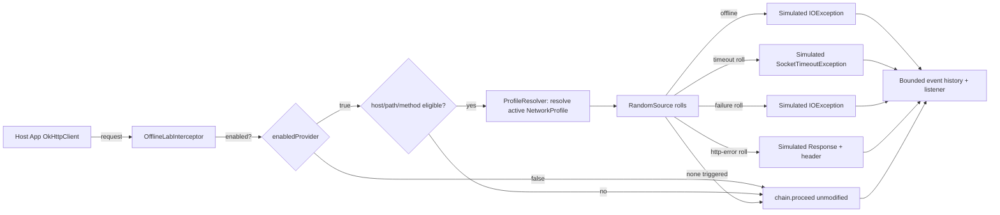

# OfflineLab

**Test how your app actually behaves offline, slow, or flaky — without leaving airplane mode on
and hoping for the best.**

[](https://github.com/Sourav19o7/offlinelab-android/actions/workflows/build.yml)


OfflineLab is a debug-only Android library that injects controlled network conditions — offline,
slow, high-latency, flaky, server errors, rate limiting, or fully custom failure/latency rates —
into your app's own OkHttp traffic, so you can test retry logic, empty states, and error handling
on demand instead of hoping you happen to hit a real network failure during QA.

> **Production readiness disclaimer**: this is a `0.1.0` MVP built for a single evaluation
> exercise. Core simulation logic has unit test coverage including seeded-random determinism
> tests, but it hasn't been exercised against a large real app's traffic patterns or audited.

## The problem

"Test the retry logic" usually means turning on airplane mode by hand, guessing at timing, and
hoping the failure lands in the code path you actually meant to test. It's slow, it's not
repeatable, and it can't simulate things airplane mode can't — a flaky connection, a 503, a
slow-but-not-dead 3G link.

## Why this exists

Real network failures are non-deterministic by nature, which makes them terrible for both manual
QA and automated tests. OfflineLab makes network failure **deterministic and on-demand**: pick a
profile (or write a custom one), make requests, and get exactly the failure mode you asked for.

## Features

- Nine profiles out of the box (see table below) plus a fully parameterized `Custom` profile.
- OkHttp `Interceptor` integration — one line added to your `OkHttpClient.Builder()`.
- Request matching by host / path prefix / method, with allow-list and deny-list support, so
  simulation can be scoped to specific endpoints instead of every request in the app.
- Deterministic testing: the interceptor's randomness goes through an injectable `RandomSource`
  seam, so profile behavior can be asserted exactly in unit tests, not just "probably."
- Local, bounded event history and a listener callback — every matched request (simulated or not)
  is recorded, so a debug panel can show clearly which results were real and which weren't.
- Debug-only safety guard: when disabled, the interceptor is a verified no-op pass-through.

## Built-in profiles

| Profile | Latency | Failure rate | Timeout rate | HTTP error rate | Notes |
|---|---|---|---|---|---|
| `Normal` | 0ms | 0 | 0 | 0 | Pure pass-through, byte-for-byte |
| `Offline` | — | — | — | — | Every matched request fails immediately, no network call |
| `Slow3G` | 1400ms | 0 | 0 | 0 | Succeeds, just slow |
| `HighLatency` | 3000ms | 0 | 0 | 0 | Heavier fixed delay |
| `RandomTimeout` | 0ms | 0 | 0.3 | 0 | 30% of matched requests simulate a timeout |
| `Flaky` | 200ms | 0.3 | 0.1 | 0.1 (503) | A mix of everything — an unreliable network |
| `ServerErrors` | 0ms | 0 | 0 | 0.5 (500) | 50% of matched requests return a simulated 500 |
| `RateLimited` | 0ms | 0 | 0 | 1.0 (429) | Every matched request returns a simulated 429 |
| `Custom(...)` | you choose | you choose | you choose | you choose | Fully parameterized |

Exact numbers live in one place: `internal/ProfileResolver.kt`, and are pinned by
`ProfileResolverTest`.

## Non-goals

- **Not** a VPN, not a system-wide proxy, no root usage. It only ever affects `OkHttpClient`
  instances the host app explicitly wires `OfflineLab.interceptor()` into.
- **No** interception of any other app's traffic.
- **Not** a true transport-level timeout simulator — see "Timeout simulation limitations" below.

## Architecture overview



See [`HOW_IT_WORKS.md`](HOW_IT_WORKS.md) for the reasoning behind this shape.

## Module structure

```text
offlinelab-android/
├── offlinelab/  # the library — dev.local.androidtools.offlinelab
│   ├── model/       # NetworkProfile, RequestMatcher, SimulatedEvent
│   └── internal/    # ProfileResolver, RandomSource, ProfileStore, MatchEvaluator, buffer
└── sample/      # Compose demo app: profile buttons, custom form, live event history
```

## Supported Android / API levels

`compileSdk`/`targetSdk` 35, `minSdk` 24. OkHttp 4.12.0 is a required (`api`) dependency — this
library's entire mechanism is an OkHttp `Interceptor`, so unlike ReproKit's optional integration,
OkHttp isn't optional here.

## Installation

Not yet published (see [`PUBLISHING.md`](PUBLISHING.md)). Include as a Gradle included build or
copy the `:offlinelab` module, same pattern as ReproKit's README.

## OkHttp integration

```kotlin
// Application.onCreate()
OfflineLab.initialize(
    context = applicationContext,
    config = OfflineLabConfig(
        enabled = BuildConfig.DEBUG,
        defaultProfile = NetworkProfile.Normal,
    ),
)

// wherever you build your OkHttpClient
val client = OkHttpClient.Builder()
    .addInterceptor(OfflineLab.interceptor(profileProvider = { OfflineLab.currentProfile() }))
    .build()
```

`profileProvider` defaults to `{ OfflineLab.currentProfile() }` already — pass it explicitly only
if you want the interceptor to read from somewhere other than the global `OfflineLab` state.

## Changing profiles

```kotlin
OfflineLab.setProfile(NetworkProfile.Offline)
OfflineLab.setProfile(NetworkProfile.Slow3G)
OfflineLab.setProfile(
    NetworkProfile.Custom(latencyMs = 1500, failureRate = 0.25, timeoutRate = 0.10, httpErrorRate = 0.15),
)
OfflineLab.resetToNormal()
```

Profile changes are picked up on the **next** intercepted request — there's no need to rebuild
the `OkHttpClient`.

## Request matching

```kotlin
OfflineLabConfig(
    enabled = BuildConfig.DEBUG,
    allowList = listOf(RequestMatcher(host = "api.example.com", pathPrefix = "/payments")),
    denyList = listOf(RequestMatcher(pathPrefix = "/health")),
)
```

An empty `allowList` means "everything is eligible" (the common case). `denyList` always wins over
`allowList`, so you can allow-list a whole host but still exempt a health-check path.

## Deterministic testing

`OfflineLabInterceptor` takes a `RandomSource` (a one-method `fun interface` — see
`HOW_IT_WORKS.md` for why it's not `kotlin.random.Random` directly):

```kotlin
val interceptor = OfflineLabInterceptor(
    enabledProvider = { true },
    profileProvider = { NetworkProfile.Custom(timeoutRate = 0.5) },
    randomSource = RandomSource { 0.1 }, // always "rolls" below the threshold
)
```

This is how `OfflineLabInterceptorTest` proves exact behavior (e.g. "a roll of 0.1 against a 0.5
timeout rate always times out") instead of relying on statistical flakiness across many runs.

## Timeout simulation limitations

`RandomTimeout`/`Custom(timeoutRate=...)` simulate a timeout by sleeping and then throwing
`java.net.SocketTimeoutException` from inside the interceptor — **before** OkHttp's own connection/
read/write timeouts would fire. This is a client-side simulation, not a transport-level one: it
does not model TCP-level connection stalls, DNS timeouts, or partial-response-then-hang scenarios,
and it will not interact with OkHttp's own `connectTimeout`/`readTimeout` configuration the way a
real network stall would. It's accurate enough to test "does my code handle a
`SocketTimeoutException` from a call" — which is usually the thing that actually needs testing —
but it is not a network-layer fault injector.

## Demo app usage

```bash
./gradlew :sample:installDebug
```

The sample app shows the active profile, buttons for every built-in profile plus a custom-profile
form, a "perform sample request" button hitting `https://example.com/`, and a live event history
showing which results were real vs. simulated. It requires the `INTERNET` permission (declared
only in the sample app's manifest, not the library's).

## CI usage

`.github/workflows/build.yml` runs unit tests, lint, and both `assembleDebug` tasks on every push/
PR — no emulator, since all interceptor tests run against a fake `Interceptor.Chain` on the JVM.

## Debug-only safety behavior

Exactly like ReproKit: `OfflineLabConfig.enabled` must be wired to your own debug flag —
OfflineLab cannot detect your build type from inside the library. When `enabled` is `false`,
`OfflineLabInterceptor.intercept()` calls `chain.proceed(request)` as its very first branch and
returns immediately — no random roll, no sleep, no event recorded. `OfflineLabInterceptorTest`'s
"disabled interceptor never touches the request regardless of profile" test asserts this even when
the active profile is `Offline` (which would otherwise always fail).

## Security and privacy

No request or response **bodies** are ever read by the interceptor — only method, URL, and status
code (for the real-response path) are involved. No `Authorization` or other headers are logged.
See [`SECURITY.md`](SECURITY.md) for the full threat model.

## Performance considerations

`Normal` profile and non-eligible (allow/deny-filtered) requests take the fastest path: a handful
of comparisons and no random draw, no sleep. Any profile with `latencyMs > 0` uses `Thread.sleep`
directly on the calling thread inside the interceptor — this is intentional (it's exactly the
delay OkHttp would normally spend waiting on I/O) but means simulated latency blocks whichever
thread issued the call, same as real network latency would.

## Known limitations

- Timeout simulation is client-side only (see above).
- `RateLimited` is a fixed rate (1.0), not a rolling request-count/time-window model.
- No instrumentation tests — everything is testable on the JVM because the interceptor is built
  against a fake `Interceptor.Chain`, but that also means no test yet exercises a real OkHttp
  connection stack end-to-end.
- Latency simulation via `Thread.sleep` on the calling thread will hold up any dispatcher thread
  pool slot it runs on; on OkHttp's default dispatcher this is fine at normal QA request volumes
  but was not load-tested at high concurrency.

## Roadmap

- `maven-publish` wiring (see `PUBLISHING.md`).
- A rolling-window `RateLimited` variant.
- Ktor/other-HTTP-client adapters (OkHttp is the only supported transport in `0.1.0`).
- Instrumentation test against a real loopback OkHttp connection.

## Testing commands

```bash
./gradlew :offlinelab:testDebugUnitTest
./gradlew :offlinelab:lintDebug
./gradlew :offlinelab:assembleDebug :sample:assembleDebug
```

## Contributing

See [`CONTRIBUTING.md`](CONTRIBUTING.md).

## License

[Apache License 2.0](LICENSE).

## Comparison with manually toggling airplane mode

| | Airplane mode | OfflineLab |
|---|---|---|
| Repeatable | No — timing varies | Yes — same profile, same behavior class every time |
| Scoped to one endpoint | No — kills all connectivity | Yes — via allow/deny `RequestMatcher` |
| Simulates *slow*, not just *down* | No | Yes (`Slow3G`, `HighLatency`) |
| Simulates HTTP-level errors (500, 429) | No | Yes (`ServerErrors`, `RateLimited`) |
| Automatable in a test | No — needs a human or device automation | Yes — plain Kotlin, runs in a unit test |
| Works in CI | No | Yes |

## Examples: testing retry and empty states

```kotlin
// Force every request to fail once, so you can verify a retry button appears and works:
OfflineLab.setProfile(NetworkProfile.Custom(failureRate = 1.0))

// Force an empty/error list state to verify your UI's empty-state rendering:
OfflineLab.setProfile(NetworkProfile.ServerErrors)

// Verify your app degrades gracefully on a bad connection instead of hanging:
OfflineLab.setProfile(NetworkProfile.Slow3G)
```

## Clear warning against shipping it enabled in production

`OfflineLab.interceptor()` should never be added to a release `OkHttpClient` with
`enabled = true`. If `enabled` is wired correctly to `BuildConfig.DEBUG` (or an equivalent flag
stripped from release builds), the interceptor becomes an inert pass-through automatically — but
OfflineLab has no way to enforce this from inside the library. **Review your `Application` /
DI setup before every release** to confirm this wiring is correct; this is a manual responsibility
the library cannot take over for you.

## FAQ

**Does this work with Retrofit?** Yes — add the interceptor to the `OkHttpClient` you pass to
`Retrofit.Builder().client(...)`; Retrofit has no separate interceptor mechanism of its own.

**Can I simulate a slow response and then a failure on retry?** Yes — call `OfflineLab.setProfile`
between attempts, or use host/path matching to apply different profiles to different endpoints by
running multiple `OkHttpClient`s with different `profileProvider`s.

**Does `Offline` make an actual network call first?** No — it throws immediately, before
`chain.proceed()` is ever invoked, so it also verifies your app doesn't accidentally depend on a
network call's side effects happening even when it fails fast.

**Why is OkHttp a required dependency instead of `compileOnly`?** Because this library's only
mechanism *is* an `okhttp3.Interceptor` — unlike ReproKit's optional network capture, there's no
meaningful "core" of OfflineLab that works without OkHttp.
